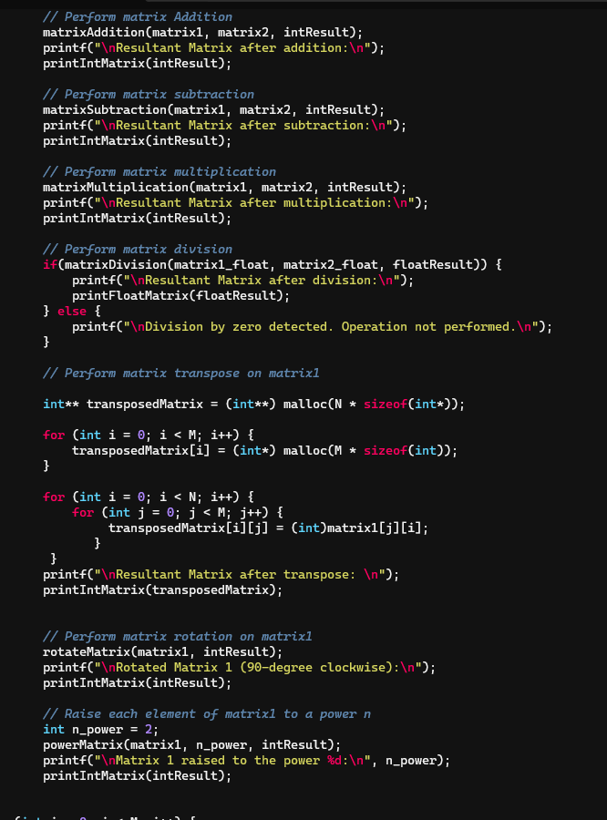
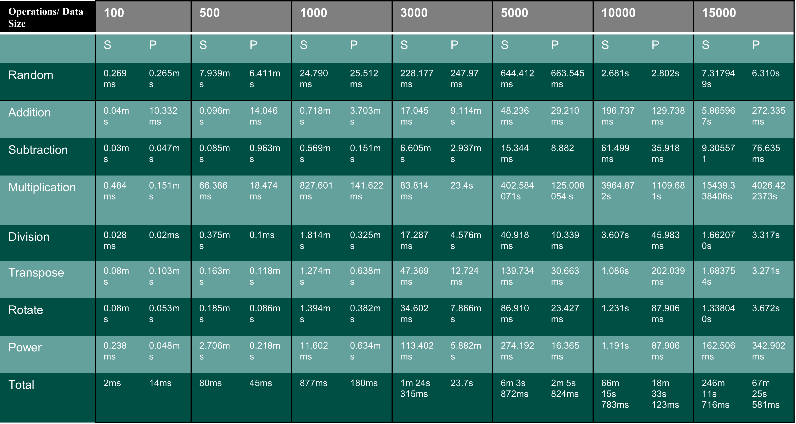

This project demonstrates benchmarks sequential and parallel processing time using a Matrix Calculator application. The parallel processing is done by using OpenACC library directives. 

Matrix Calculator contains the following operations:

- Matrix Addition: Each element in the result matrix is the sum of the corresponding elements in the two input matrices. Parallel Loops are used to perform addition on each element.
- Matrix Subtraction: Parallelization of element-wise subtraction
- Matrix Multiplication: Parallelization over the rows of the first matrix and the columns of the second matrix( Block Matrix Multiplication Method)
- Matrix Division: Parallelization over element-wise division.
- N Power Matrix: Parallelization of element-wise power.
- Rotate Matrix by 90 Degrees: Dividing the matrix into smaller blocks and performing rotation on each block.
- Transpose of a Matrix: Parallelization on separate rows and columns simultaneously. 

Execution Process:
1) Individual Files along with a random_matrix.c file is Compile using Makefile.
2) Execution occurs in the following flow:
	- Addition
	- Subtraction
	- Multiplication
	- Division
	- Transpose	
	- Rotate 90 Degrees Clockwise
	- N Power Matrix
3) The above functions are executed sequentially one after the other.
4) A Separate file header file is created to define the matrix Size, M- Number of Rows and N - Number of Columns

Steps to Replicate

On Windows:

1) Start up windows desktop and type in the search menu for "Windows Features".

2) Enable the "Windows Subsystem for Linux" in the "Windows Features dialog box. 

3) Restart the system.

4) Enable the Use of WSL by following the instructions present here: https://learn.microsoft.com/en-us/windows/wsl/install. ( Install Ubuntu Flavor from Microsoft store).

5) Switch from WSL1 to WSL2.

6) Once Step 5 is done, Type in the search bar for Ubuntu and open the terminal.

7) Switch to superuser using the command sudo su.

8) Install build essentials and update.

9) Download NVIDIA HPC SDK from here: https://developer.nvidia.com/hpc-sdk. ( Choose Linux x86_64(tar file), Bundled with newest CUDA version) 

10) Enable NVIDIA CUDA on WSL (Optional, only if you use GPU) : https://docs.nvidia.com/cuda/wsl-user-guide/index.html#getting-started-with-cuda-on-wsl.

11) Make sure to follow the steps in here correctly to run a sample program using OpenACC: https://docs.nvidia.com/hpc-sdk/pgi-compilers/20.1/x86/openacc-gs/index.htm

12) Compile your openACC code using the "make" command.

13) Run the executable file. 

On Linux:

For Running the project directly on Linux Environment:

1) Install OpenACC from the OpenACC website.
2) Directly copy the code into the working directory.
3) Set the matrix size you want to test in matrixSize.h
4) Run the code using the “make” command.
5) Once the executable is created, run it using 
“ ./sequential_calculator” for a sequential program and “./parallel_calculator” for the parallel program.  ( The Object executables may refer)

List of Operations:

Processing Timing Table:

